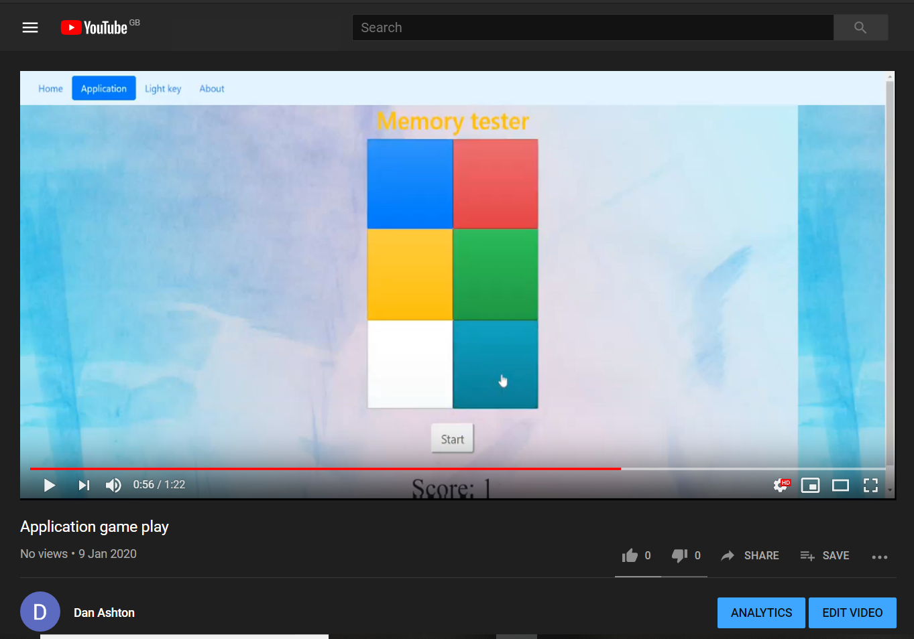
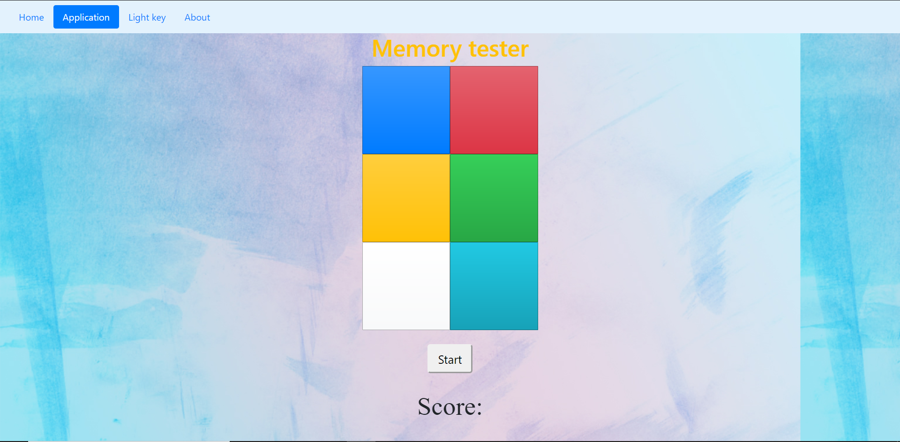
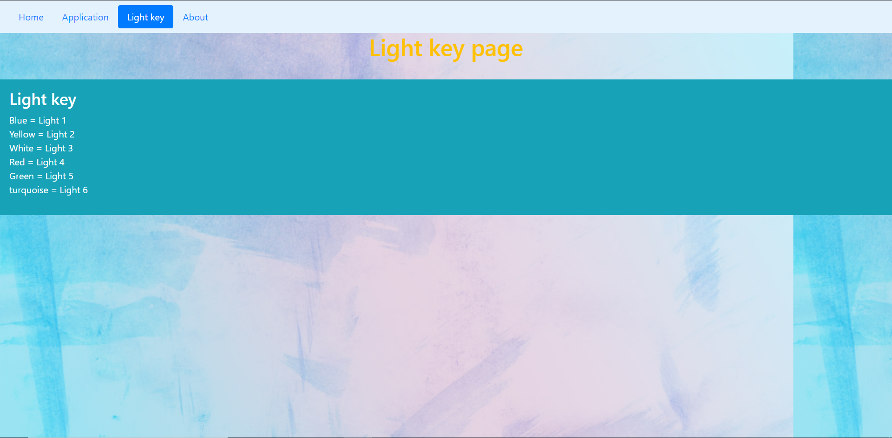
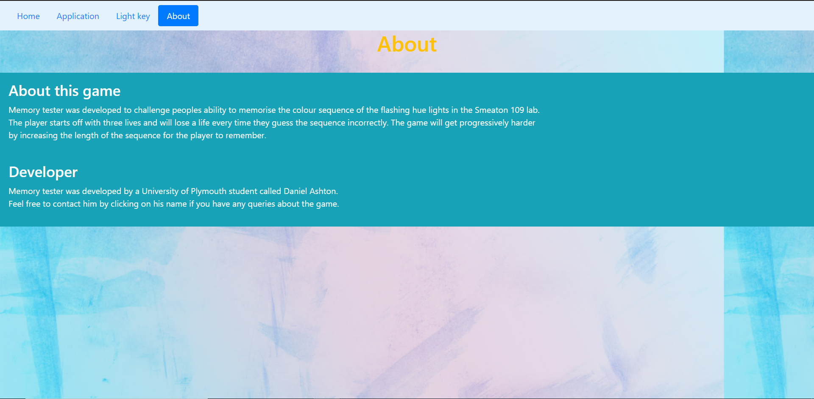
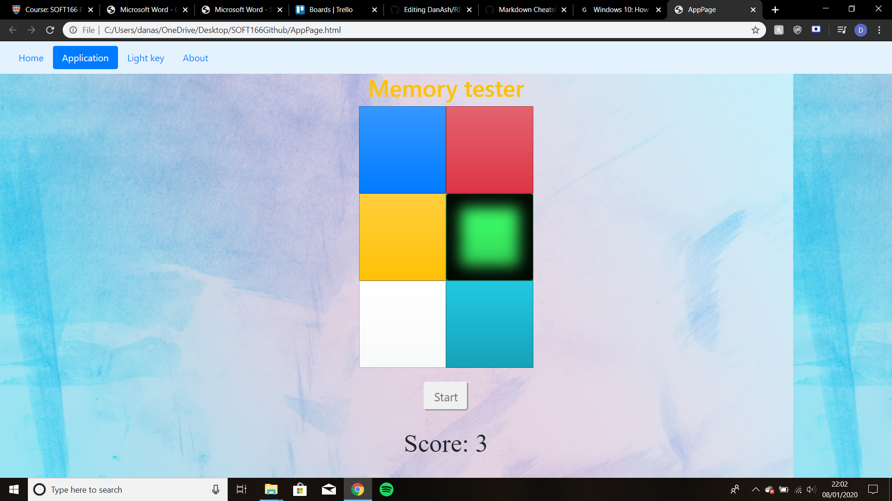
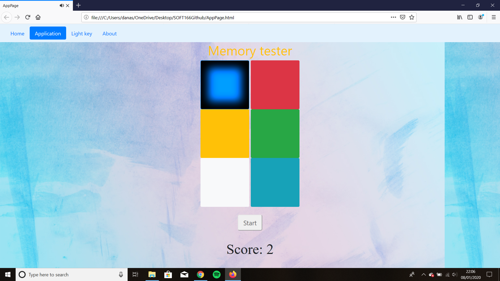

# DanAsh
My Repository for demonstrating Hue lights memory tester game project.

Welcome to the repository for the development of Memory tester. This game is designed to allow the user to enter the colour sequence they think they saw the colour grid make, the game then determines whether the user is correct or not and progressivly makes the game more challenging by increasing the length of the sequence until the user runs out of lives.

I have created the pages and linked them together so i can navigate between them using a fixed navagation bar at the top of the page.
I have added some bootstrap code so I can use the CSS to for things like my navigation bar.

## Youtube video
Application demonstration:
---

## Application fact sheet
[Application fact sheet](Application%20fact%20sheet.docx)
---
## Screenshots
Home page: 

Application page:

Lights key page:

About page:

## Web accessibility
Testing on the application was carried out on Google chrome and Firefox.

Chrome test:

Firefox test:

Screenshots are provided to illustrate the testing.

